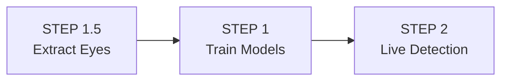

# Real-Time Driver Drowsiness Detection — EAR and CNN Hybrid Approach

Driver drowsiness is a leading cause of road accidents worldwide. This project presents a real-time driver drowsiness detection system that combines classical computer vision techniques (Eye Aspect Ratio) with deep learning (Convolutional Neural Networks) to accurately identify drowsy drivers and issue timely alerts.

## Overview

The project is structured as a **3-stage pipeline** that trains deep learning models on eye images and deploys them for real-time webcam-based drowsiness detection.

1. **Stage 1.5 — Eye Extraction** (`STEP1_5_extract_eyes.py`)
   - Uses MediaPipe FaceLandmarker to detect 478 facial landmarks.
   - Extracts left and right eye crops from full-face images.
   - Prepares the dataset by ensuring the CNN focuses purely on eye openness rather than subject identity, skin tone, or background.

2. **Stage 1 — Model Training** (`STEP1_train_model.py`)
   - Trains custom CNN architectures and fine-tunes MobileNetV2 on the extracted eye crops.
   - Includes data augmentation, mixed precision training (AMP), learning rate scheduling, and early stopping.
   - Evaluates on 8 key metrics to ensure high robustness.

3. **Stage 2 — Real-Time Detection** (`STEP2_live_detection.py`)
   - Captures live webcam feed and extracts the Eye Aspect Ratio (EAR) dynamically.
   - Runs CNN inference on the eye crops.
   - Fuses the EAR geometric score and the CNN probability for a highly reliable **Hybrid Score**.
   - Triggers an audible alert if the driver is detected as drowsy for a consecutive number of frames.

## Architecture

## Setup & Requirements

- Python 3.8+
- PyTorch & TorchVision
- MediaPipe
- OpenCV (`cv2`)
- NumPy, scikit-learn, Matplotlib, Seaborn, SciPy

## Usage

1. **(Optional) Data Preparation**: Run `STEP1_5_extract_eyes.py` to prepare eye crops from your raw dataset of face images.
2. **(Optional) Training**: Run `STEP1_train_model.py` to train the CNN and MobileNetV2 models from scratch.
3. **Live Detection**: Run `STEP2_live_detection.py` to launch the real-time webcam inference and drowsiness detection interface. Press `Q` to quit, `S` for a screenshot, `R` to reset, and `+`/`-` to adjust sensitivity.

## Technical Highlights

- **Hybrid EAR-CNN Fusion**: Combines geometric reliability of EAR with deep learning's ability to capture subtle drowsiness cues. 
- **Transfer Learning**: Leverages MobileNetV2 pretrained on ImageNet.
- **Auto-Retrain Loop**: Training pipeline includes quality checks that automatically retrain models if core metrics drop below 90%.
- **Robust HUD**: Real-time Heads-Up Display showing FPS, EAR, CNN probability, hybrid score, and drowsiness alerts.
